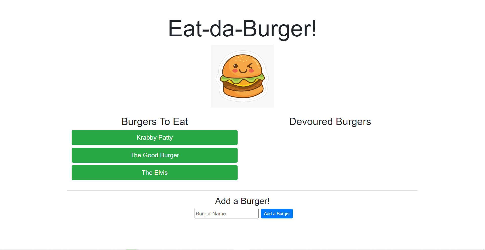
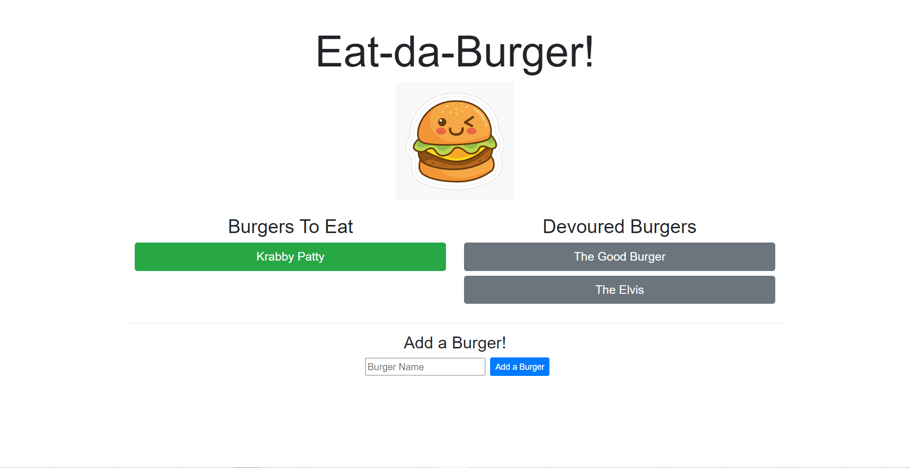

# eat-da-burger

## Table of Contents
* [Description](#Description)
* [Links](#Links)
* [Design Elements](#Design-Elements)
* [App Preview](#App-Preview)
* [Credits](#Credits)

## Description
This is a simple restaurant app that enables users to create fictional burgers and eat them too! Do you dream about tasty burgers? Here is a place where you can create any burger you desire and eat it online!

## Links
* Website: https://eat-da-burger-zachdrummond.herokuapp.com/
* GitHub Repository: https://github.com/zachdrummond/eat-da-burger

## Design Elements
### *JavaScript - Node.js*
* Node Package Manager - Express, Express-Handlebars, MySQL
* Model View Controller Architecture
* Object Relational Mapper
* Routing
* Middleware Functions
* View Engine Template
* Server-Side Rendering
* JSON
* Modules
* Promises
* DOM Manipulation
* AJAX
* Event Listeners
* Objects
* Methods
* Functions
* PORTs & Environment Variables
* If...else statements
* Comments

### *MySQL*
* Database
* Tables
* Columns and Rows

### *Handlebars*
* Partials
* Triple Stash
* Double Stash
* Built-in Helpers
* Comments

### *Bootstrap*
* Grid System
* Buttons
* Alignment
* Colors

### *CSS*
* Font
* Width

## App Preview

## Credits
* https://nodejs.org/en/
* https://www.npmjs.com/
* https://www.npmjs.com/package/nodemon
* https://www.npmjs.com/package/mysql
* https://www.mysql.com/
* http://expressjs.com/
* https://getbootstrap.com/
* https://jquery.com/
* https://www.heroku.com/
